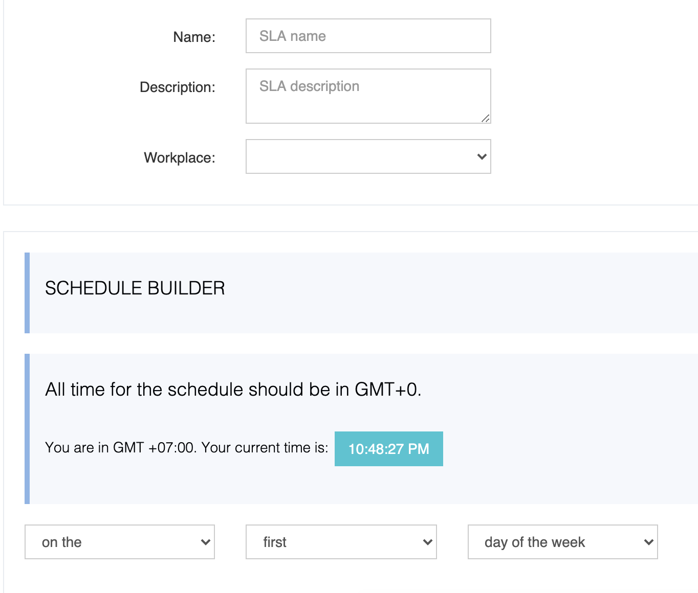
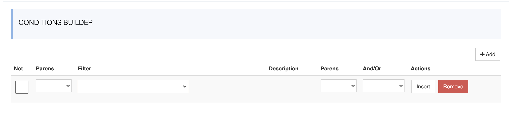
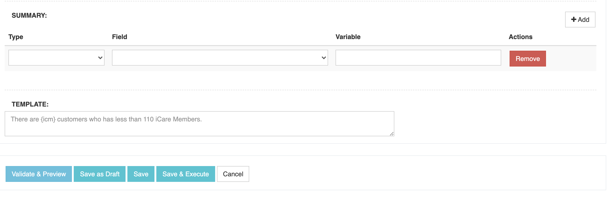

# Keyes | Eyes

> Karros's Eyes Or Edulog's Eyes

Karros has many products with a vision that "Help the students come to school in safety", day by day, thousands of students and drivers and event parents will involve in every trip of the students to school in their own ways. We provide products to our clients, and we also need to defines the Service Level Agreement (SLA) on every products that we are providing, but how can we keep tracking that our products are working well on the vision our our company, which can answer the common questions of clients & users:

- Today we have 700 buses which will pick up 15,000 students, are they all finished their job?
- How many students are in the bus?
- Is there any bus that was mis-picking up students?
- ....

Those questions can be resolve by Keyes (Karros's Eyes) or Eyes (Edulog's Eyes)
Keyes / Eyes is designed base on the idea of the God's Eyes in Fast & Furious Series. It can collect insight & useful data from all of the products of Edulog & Karros (eTM, Athena, DriverPortal, ParentPortal, ...) summarize them base on the SLA that customers defined and feeds information gathered back to its user "under four minutes or less" to use to their whims.
It will give clients the ability to define their own SLA conditions, in their concern, and verify it in realtime or schedule for it to check frequently.

SLA conditions can be like these:

    Name: Verify buses pickup students
    Schedule: check and send report daily at 11:00 AM
    Filters:
    	(tenant is chiefleschi and school any_of ['a', 'b', 'c']) or (tenant is hopewell and school is 'd')
    Summary:
    	"total healthy buses" as total_buses
    	"total failed buses" as failed_buses
    	"total running buses" as working_buses
    	"total picked-up students" as total_students
    	"total on-bus students" as onbus_students
    	"working_buses / total_buses * 100" as healthy_buses_percentage
    	"onbus_students / total_students * 100" as safety_students_percentage

    Message Template:
    	Today, There're {healthy_buses_percentage}% of Healthy Buses are on their way to pick up students,
    	And {safety_students_percentage}% of Students are on the healthy buses and coming to school safety.

Review Images:

SLA Information

SLA Defininition

SLA Summarize & Message Template

